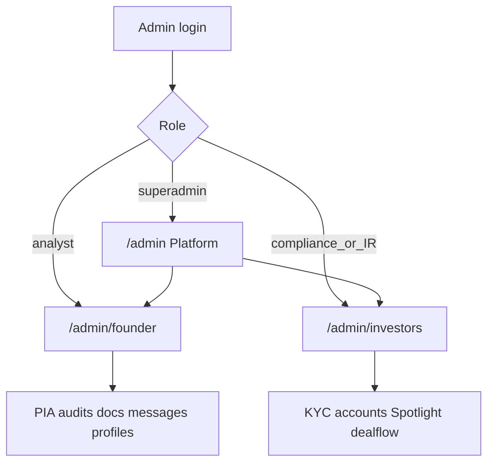

# Implementation Plan — Admin Desks + Full Pre-Launch Fix

## Locked decisions

- **Architecture:** one staff login; two peer desks + small Platform for Superadmin. Forget Model C.
- **Roles stay job titles:** `analyst` on Founder desk; `compliance` / `investor_relations` on Investor desk; `superadmin` enters all.
- **URLs:** `/admin/founder/*`, `/admin/investors/*`, Platform stays `/admin/*` (dashboard, team, settings, revenue, blog, PIA).
- **Waitlist:** fully removed from the codebase (no routes, UI, model, or legacy redirect).
- **`support` role:** retire from operable staff (migrate any existing to `analyst` or remove access); messages belong on Founder desk for `superadmin` + `analyst`.
- **Money path:** already live (PIA request → offline confirm → BoldSign → setup). No Phase 3 rebuild. Paystack dead-code cleanup only in a later cleanup phase.
- **Delivery:** one phase at a time; verify before starting the next.

## Phase 1 — Access model only

**Goal:** Enforce who can enter which desk; no full UI rewrite yet.

**Change:**
- Extend [`app/Models/User.php`](app/Models/User.php): `canAccessFounderAdmin()`, `canAccessInvestorAdmin()`, `canAccessPlatformAdmin()`, `defaultAdminHomeRoute()`, `canOperateAdmin()` (exclude retired `support`).
- Add middleware e.g. `EnsureAdminSide` + alias `admin.side:founder|investors|central` in [`bootstrap/app.php`](bootstrap/app.php).
- Update login redirect in [`AuthenticatedSessionController`](app/Http/Controllers/Auth/AuthenticatedSessionController.php) to use `defaultAdminHomeRoute()`.
- Keep existing routes temporarily; wrap groups with side middleware as routes are regrouped, or add redirects from old paths once Phase 2 starts.
- Feature tests: access matrix (analyst blocked from investor routes; compliance blocked from founder routes; superadmin allowed everywhere).

**Done when:** wrong-role users cannot enter the wrong desk; login lands on the correct home; tests green.

---

## Phase 2 — Three shells + route split

**Goal:** Kill the mixed confusing sidebar.

**Change:**
- Regroup [`routes/web.php`](routes/web.php) admin routes under:
  - Platform (`admin.side:central`): `/admin` dashboard, users, settings, revenue, blog, PIA requests
  - Founder desk (`admin.side:founder`): messages, founders, documents, profiles, questions
  - Investor desk (`admin.side:investors`): investor-accounts, KYC, spotlight, dealflow, announcements
- Rewrite [`resources/js/layouts/admin-layout.tsx`](resources/js/layouts/admin-layout.tsx) into three shells (or shell prop) with desk switcher for superadmin only.
- Split dashboard metrics in [`AdminDashboardController`](app/Http/Controllers/Admin/AdminDashboardController.php) into platform / founder / investor views.
- Fix Team CRUD in [`AdminUserController`](app/Http/Controllers/Admin/AdminUserController.php) + Create/Edit UI: allow `superadmin|analyst|compliance|investor_relations` (drop `support` from create).
- Old URL redirects (`/admin/founders` → `/admin/founder/founders`, etc.).
- Put Diligence, Announcements, Questions in the correct desk nav (no more hidden-but-authorized pages).

**Done when:** each role sees only operable nav; no 403 dead links; company can run ops without memorizing URLs.

---

## Phase 3 — SKIPPED (already implemented)

PIA offline path, checkout request UX, admin confirm + agreement invite already work. No build work here.

---

## Phase 4 — Founder desk completeness

**Goal:** Analyst/superadmin can run audits safely and clearly.

**Change:**
- Messages only on Founder desk; fix founder unread badge (share prop in [`HandleInertiaRequests`](app/Http/Middleware/HandleInertiaRequests.php)); scope analyst inbox/reply to assignments.
- Enforce `canAccessFounder` on [`AdminDocumentController`](app/Http/Controllers/Admin/AdminDocumentController.php), profiles, founder show — close IDOR gaps.
- Polish assign analyst + audit status; remove synthetic “create fake paid payment” hazard in [`AdminFounderController`](app/Http/Controllers/Admin/AdminFounderController.php).
- Founder portal: add Diligence to [`founder-layout`](resources/js/layouts/founder-layout.tsx) nav; fix setup/welcome mail if still unused; password-reset double-hash if still present.

**Done when:** assigned-only access holds; messages/badges work; audit → complete → profile reliable.

---

## Phase 5 — Investor desk completeness

**Goal:** Compliance + IR can run PIN end-to-end.

**Change:**
- KYC first-class for compliance; IR cannot review docs (keep server rule; make UI honest).
- Wire account status updates in Investor Accounts UI to real DB statuses (`pending_review|active|rejected`); fix TS type drift (`suspended`).
- Keep onboarding auto-`active` for now; status UI is for suspend/reject/reactivate.
- Spotlight + dealflow nav complete; diligence admin loop already exists — add **investor diligence submit UI** calling existing `investor.diligence.store`.
- Enforce post-introduction gate in [`DiligenceWorkflowService`](app/Services/DiligenceWorkflowService.php) before submit.
- Announcements visible on Investor desk nav.
- Data room reinstate: add investor notification if missing.

**Done when:** KYC → Spotlight → interest → founder auth → IR activate → diligence works with mediation rules enforced in UI + server.

---

## Phase 6 — Cleanup of discovery gaps

**Goal:** Close orphans and product mismatches.

**Change:**
- Migrate/remove `support` users; stop treating support as operable admin.
- Remove or quarantine orphans: empty `InvestorAccessLogController`, unused Investor Dashboard route if still orphaned.
- Paystack leftovers: remove or clearly legacy-mark unrouted `initiate`, trim Revenue “Paystack dashboard” CTA; keep historical `paystack_reference` column for offline refs.
- Align [`CLAUDE.md`](CLAUDE.md) and [`docs/INVESTOR-PORTAL-SPEC.md`](docs/INVESTOR-PORTAL-SPEC.md) with desks + roles + PIA money path.
- Diagnostic open session restore / CSRF exemptions: harden for launch if still present.

**Done when:** no critical orphan flows; docs match product.

---

## Phase 7 — Hardening + QA

**Goal:** Software side launch-ready.

**Change:**
- Feature tests: desk access, PIA offline path, mediation (interest/diligence/data room), KYC.
- Manual QA checklist per role (superadmin, analyst, compliance, IR) + founder + investor happy paths.
- Pint / lint / build clean; fix severity issues from QA.

**Done when:** role matrix and journeys verified; ops can use a one-page desk guide.

## What we will not do

- Rebuild Model C as previously coded.
- Reintroduce Paystack as the high-ticket happy path.
- Mix founder and investor work into one sidebar again.
